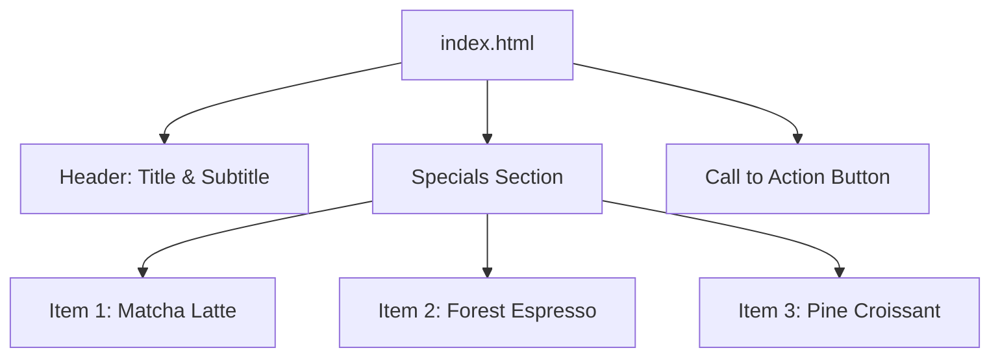
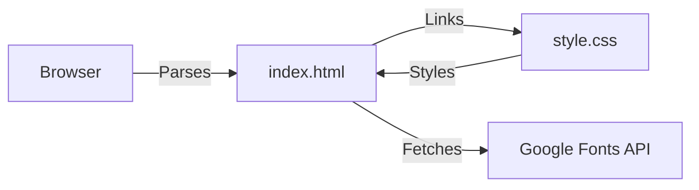

# Tech Stack Setup Guide

## Tech Stack
- **Language**: HTML5, CSS3 (Vanilla)
- **Framework**: None (Static Site)
- **Runtime**: Web Browser (Chrome, Firefox, Safari, Edge)
- **Package Manager**: None
- **Key Libraries**: Google Fonts (Inter)
- **Version Constraints**: Works on any modern web browser supporting CSS Custom Properties and Flexbox.

## Setup Instructions

### macOS
1. Open Terminal.
2. Clone the repository: `git clone <repository-url>`
3. Navigate to the project folder: `cd TIP_Coffee-Cafe`
4. Open `index.html` in your default browser: `open index.html`

### Windows
1. Open Command Prompt or PowerShell.
2. Clone the repository: `git clone <repository-url>`
3. Navigate to the project folder: `cd TIP_Coffee-Cafe`
4. Open `index.html` in your default browser: `start index.html`

### Linux
1. Open Terminal.
2. Clone the repository: `git clone <repository-url>`
3. Navigate to the project folder: `cd TIP_Coffee-Cafe`
4. Open `index.html` in your default browser: `xdg-open index.html`

## Architecture Visualizations

### Component Structure

### Styling Dependency

## Troubleshooting Tips
- **Styles not loading?** Ensure that `style.css` is in the same directory as `index.html`. Check browser console for 404 errors.
- **Fonts not rendering?** Ensure you have an active internet connection, as the "Inter" font is fetched from Google Fonts.
- **Layout looks broken?** Make sure you are using a modern browser (updated within the last 3 years) that supports CSS Flexbox and variables.
